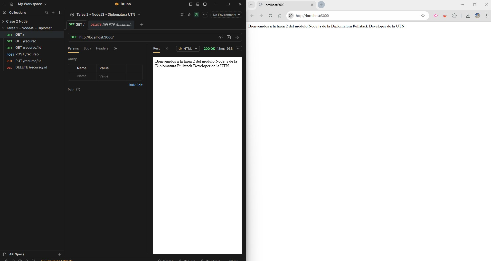
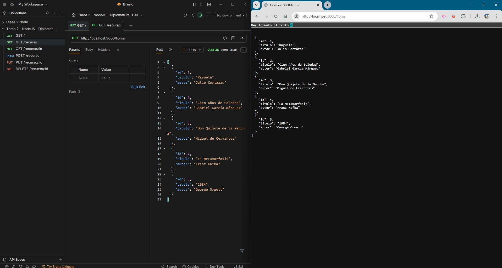
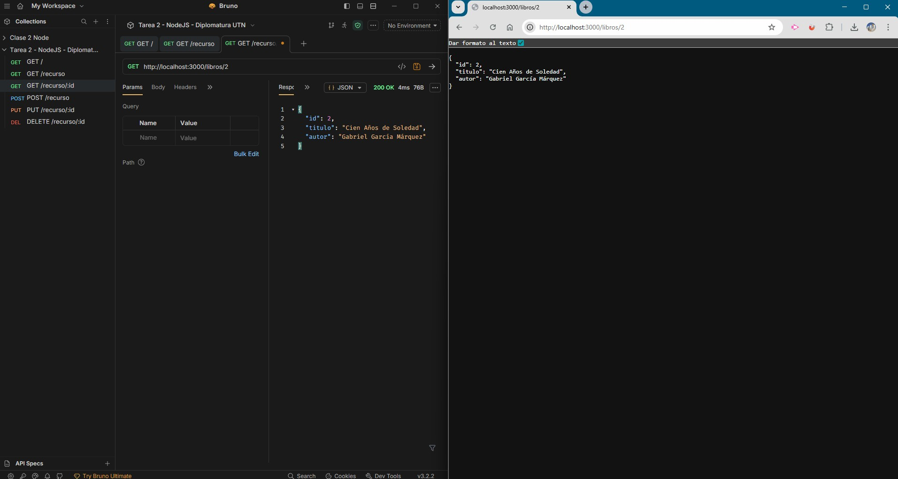
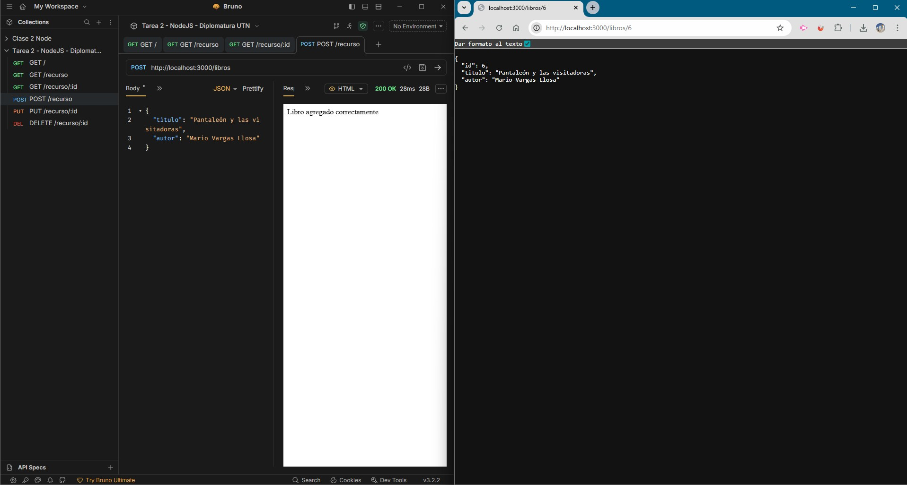
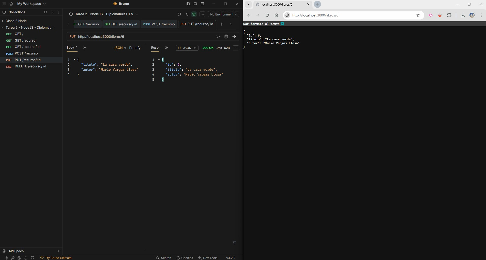
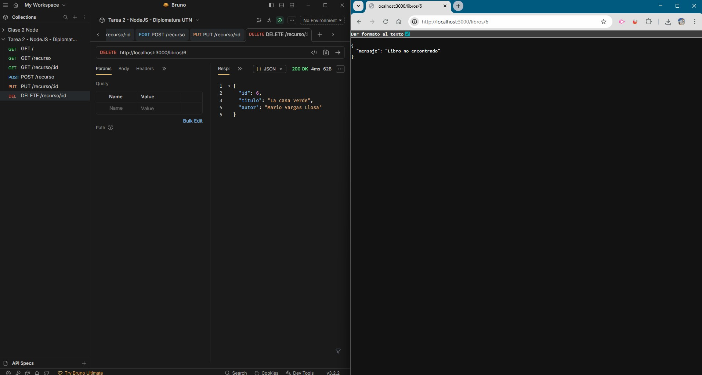

# Módulo 1 — Unidad 2

## 📌 Tarea 2: Mi primera API REST con Express

---

# 📖 Descripción

Este proyecto fue desarrollado como parte del **Módulo 1 — Unidad 2**
del curso **Desarrollo con Node.js**.

El objetivo de la actividad fue:

- Crear un servidor backend con Express
- Implementar rutas RESTful
- Manipular datos en formato JSON
- Probar endpoints utilizando una herramienta de testing (Bruno)

La API permite gestionar un recurso de tipo **libros**, simulando operaciones CRUD:

- Obtener todos los libros
- Obtener un libro por ID
- Crear un nuevo libro
- Editar un libro existente
- Eliminar un libro

---

# 🚀 Tecnologías utilizadas

- Node.js
- Express.js
- JavaScript (CommonJS)
- Bruno (para pruebas de API)

---

# 🗂️ Estructura del proyecto

    modulo-1-tarea-2/
    │
    ├── assets/
    │   ├── 1_request_home.jpg
    │   ├── 2_get_books.jpg
    │   ├── 3_get_book_id_2.jpg
    │   ├── 4_post_book.jpg
    │   ├── 5_edit_book.jpg
    │   └── 6_delete_book.jpg
    │
    ├── node_modules/
    ├── package.json
    ├── package-lock.json
    ├── server.js
    └── README.md

---

# 🔗 Endpoints implementados

### GET /

Devuelve un mensaje de bienvenida.

---

### GET /libros

Devuelve un listado de libros en formato JSON.

---

### GET /libros/:id

Devuelve un libro específico según su ID.

---

### POST /libros

Permite agregar un nuevo libro enviando los datos en formato JSON:

    {
      "titulo": "Nuevo libro",
      "autor": "Autor"
    }

---

### PUT /libros/:id

Permite actualizar un libro existente.

---

### DELETE /libros/:id

Permite eliminar un libro por ID.

---

# 🧪 Pruebas realizadas

Las pruebas de los endpoints se realizaron utilizando **Bruno**.

Se incluyen capturas en la carpeta `assets/` donde se evidencia:

- Respuesta de la ruta raíz
- Obtención de todos los libros
- Consulta por ID
- Creación de un libro
- Edición de un libro
- Eliminación de un libro

---

# 🖼️ Capturas de pantalla

### 🏠 Request a la ruta raíz

### 📚 Obtener todos los libros

### 🔍 Obtener libro por ID

### ➕ Crear un nuevo libro

### ✏️ Editar un libro

### 🗑️ Eliminar un libro

---

# ⚙️ Instalación y ejecución

## 1️⃣ Clonar el repositorio

    git clone https://github.com/argenisjpinto/tareas-diplomatura-nodeJS-999201567.git

## 2️⃣ Instalar dependencias

    npm install

## 3️⃣ Ejecutar el servidor

    node server.js

El servidor se ejecutará en:

    http://localhost:3000

---

# 🧠 Conceptos aplicados

- Creación de servidor con Express
- Uso de middlewares (`express.json`)
- Rutas RESTful
- Manejo de parámetros (`req.params`)
- Manejo de datos en JSON
- Métodos HTTP: GET, POST, PUT, DELETE

---

# 👨‍🎓 Autor

Argenis Pinto  
Curso: Desarrollo con Node.js  
Módulo 1 — Unidad 2  
Centro de e-Learning UTN BA

---

# 📚 Bibliografía

Documentación oficial de Express  
https://expressjs.com/

Material del curso UTN — Centro de e-Learning

Conceptos de API REST  
https://developer.mozilla.org/es/docs/Glossary/REST