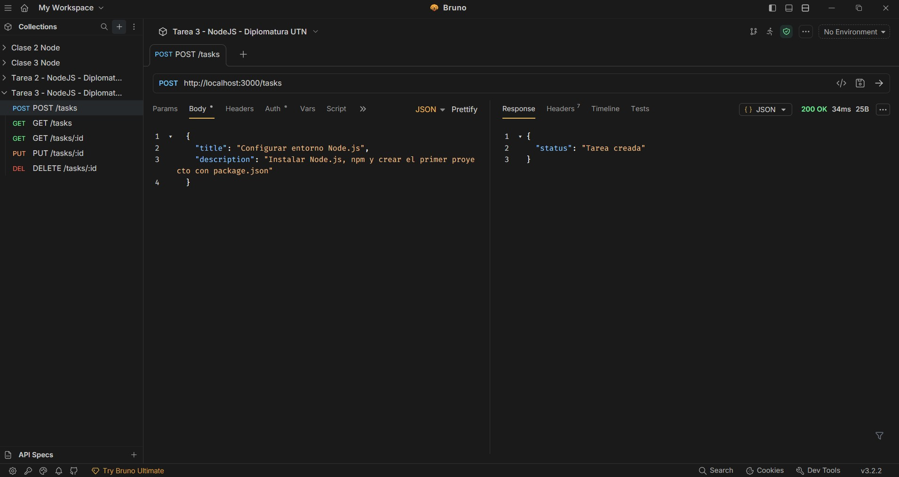
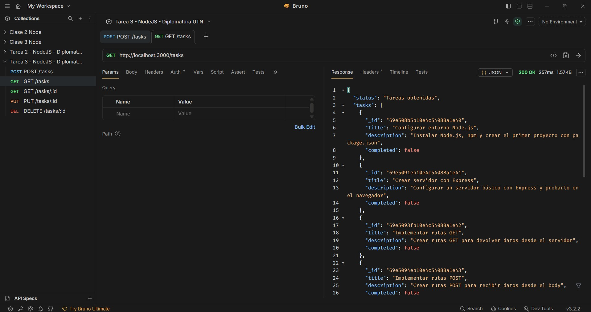
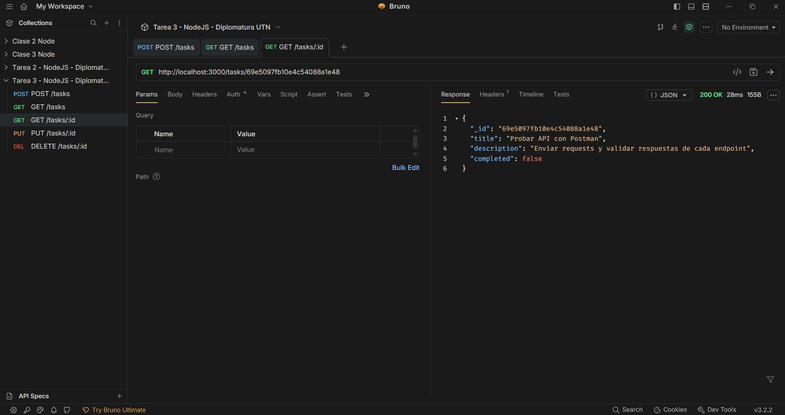
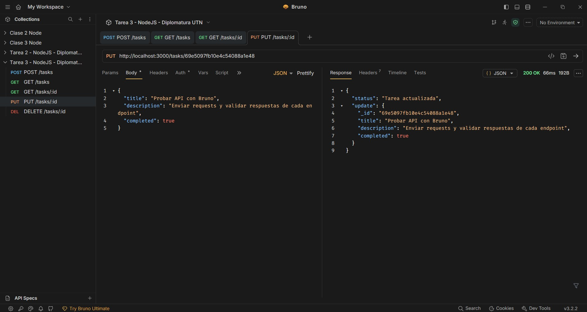
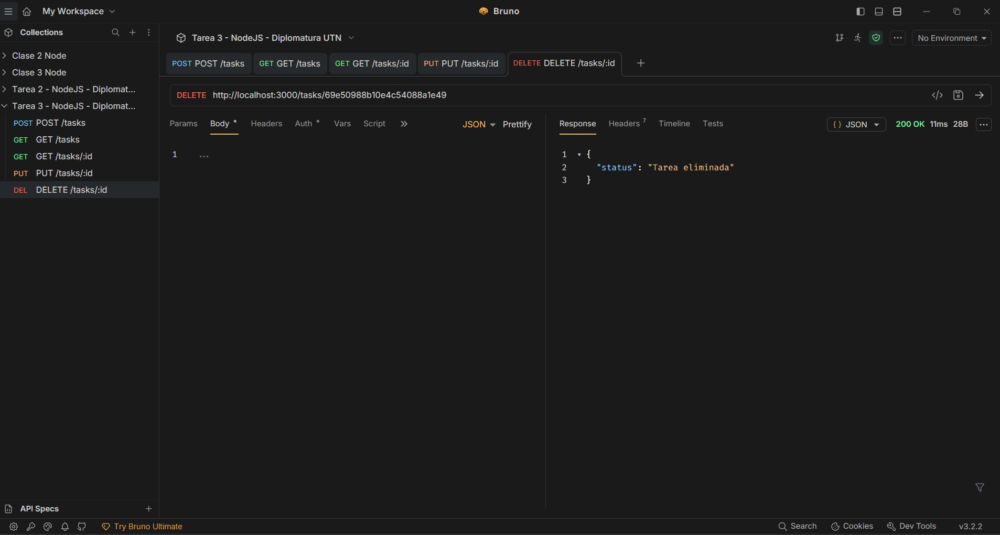
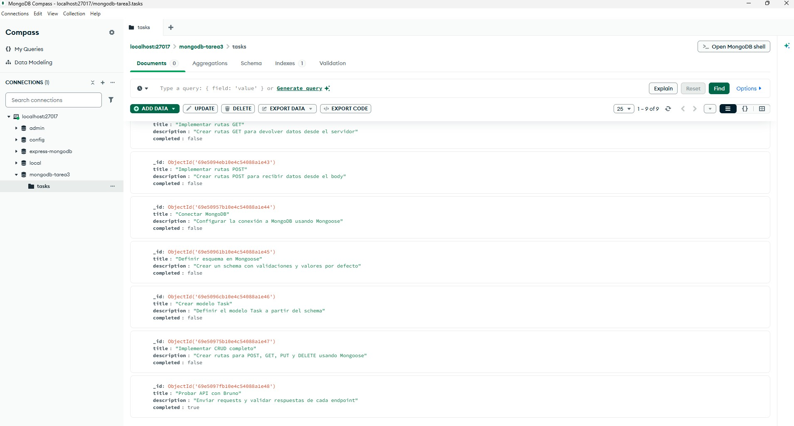

# Módulo 1 — Unidad 3

## 📌 Tarea 3: API REST con MongoDB y Mongoose

---

# 📖 Descripción

Este proyecto fue desarrollado como parte del **Módulo 1 — Unidad 3**
del curso **Desarrollo con Node.js**.

El objetivo de la actividad fue:

- Conectar una API en Express a una base de datos MongoDB
- Utilizar Mongoose como ODM
- Definir un esquema y modelo de datos
- Implementar operaciones CRUD persistentes
- Probar los endpoints con Bruno

La API permite gestionar un recurso de tipo **tareas**.

---

# 🚀 Tecnologías utilizadas

- Node.js
- Express.js
- MongoDB
- Mongoose
- dotenv
- Bruno

---

# 🗂️ Estructura del proyecto

```
modulo-1-tarea-3/
│
├── assets/
│   ├── 1_post_tasks.jpg
│   ├── 2_get_tasks.jpg
│   ├── 3_get_task_id.jpg
│   ├── 4_put_task_id.jpg
│   ├── 4_delete_task_id.jpg
│   └── 5_bd_mongodb.jpg
│
├── node_modules/
├── .env
├── package.json
├── package-lock.json
├── server.js
└── README.md
```

---

# 🔗 Endpoints implementados

### POST /tasks

Crear una nueva tarea:

{
  "title": "Nueva tarea",
  "description": "Descripción de la tarea"
}

---

### GET /tasks

Obtiene todas las tareas.

---

### GET /tasks/:id

Obtiene una tarea por ID.

---

### PUT /tasks/:id

Actualiza una tarea.

---

### DELETE /tasks/:id

Elimina una tarea.

---

# 🧪 Pruebas realizadas

Las pruebas se realizaron con **Bruno**.

---

# 🖼️ Capturas de pantalla

### ➕ Crear tarea


### 📋 Obtener tareas


### 🔍 Obtener tarea por ID


### ✏️ Actualizar tarea


### 🗑️ Eliminar tarea


### 🗄️ Base de datos MongoDB


---

# ⚙️ Instalación y ejecución

1. npm install  
2. Crear archivo `.env`:

MONGODB_URI=mongodb://localhost:27017/mongodb-tarea3

3. Ejecutar:

node server.js

Servidor en:
http://localhost:3000

---

# 🧠 Conceptos aplicados

- Mongoose (ODM)
- CRUD persistente
- Express + MongoDB
- Variables de entorno

---

# 👨‍🎓 Autor

Argenis Pinto  
Diplomatura NodeJS - UTN