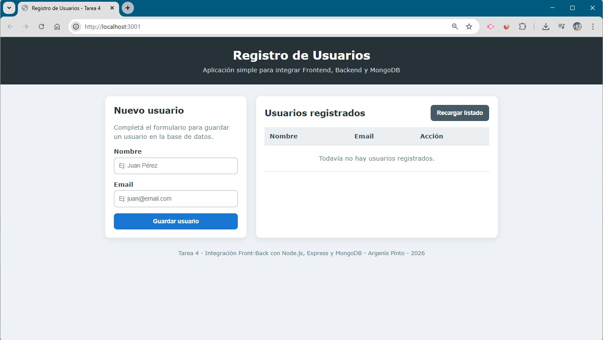
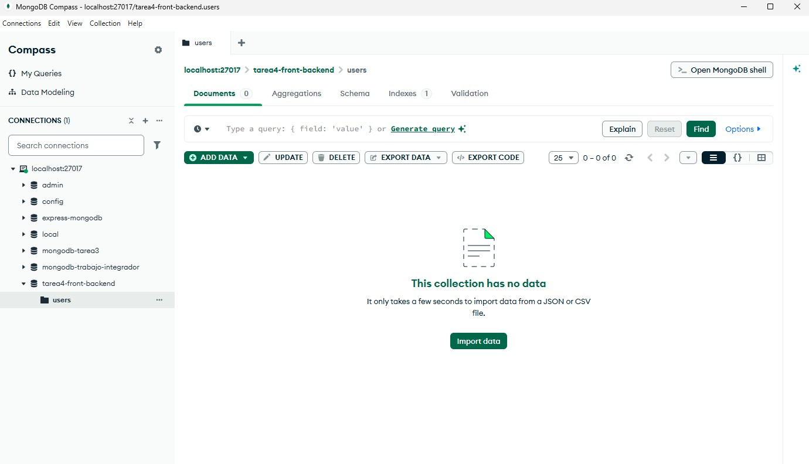
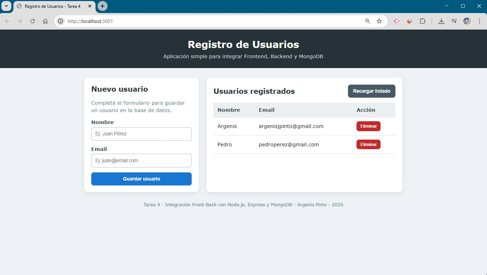
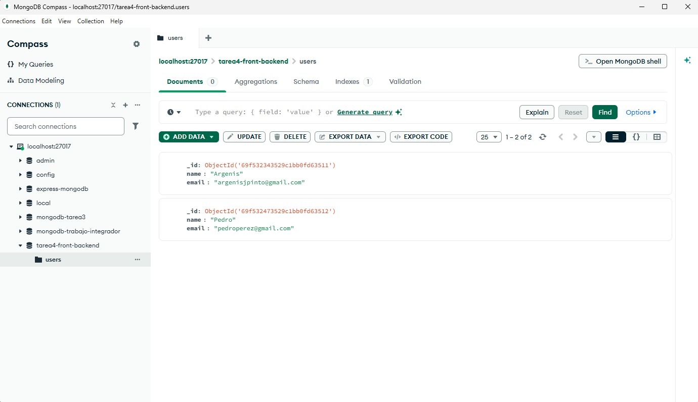

# Tarea 4 - Integración Front-Back con Node.js, Express y MongoDB

Proyecto desarrollado para la **Unidad 4 del Módulo 1 de Node.js**, cuyo objetivo es integrar un frontend sencillo con una API creada en Express y conectada a una base de datos MongoDB.

La aplicación permite registrar usuarios desde un formulario web, consultar los usuarios guardados en la base de datos y eliminarlos desde la interfaz.

---

## 📌 Descripción del proyecto

Este proyecto consiste en una aplicación simple de registro de usuarios, donde se integran tres partes principales:

- **Frontend:** página HTML, CSS y JavaScript ubicada en la carpeta `public`.
- **Backend:** servidor creado con Node.js y Express.
- **Base de datos:** MongoDB local, utilizando Mongoose para la conexión y el modelo de datos.

La página web consume la API mediante peticiones HTTP:

- `GET /users`: obtiene los usuarios registrados.
- `POST /users`: guarda un nuevo usuario.
- `DELETE /users/:id`: elimina un usuario existente.
- `PATCH /users/:id`: actualiza un usuario existente.

También se agregó manejo de mensajes, estado de carga y control básico de errores para mejorar la experiencia del usuario.

---

## 🧰 Tecnologías utilizadas

- Node.js
- Express
- MongoDB
- Mongoose
- JavaScript
- HTML5
- CSS3
- dotenv
- CORS

---

## 📁 Estructura del proyecto

```bash
modulo-1-tarea-4/
├── assets/
│   ├── 1_home.jpg
│   ├── 2_users_empty_mongoDb.jpg
│   ├── 3_users_saved.jpg
│   └── 4_users_saved_mongoDb.jpg
│
├── node_modules/
│
├── public/
│   └── index.html
│
├── src/
│   ├── config/
│   │   └── connectDb.js
│   │
│   ├── controllers/
│   │   └── user.controller.js
│   │
│   ├── models/
│   │   └── user.model.js
│   │
│   ├── routes/
│   │   └── user.route.js
│   │
│   └── app.js
│
├── .env
├── .env.example
├── .gitignore
├── package-lock.json
├── package.json
└── README.md
```

> Nota: la carpeta `node_modules` no debe subirse al repositorio, ya que se genera automáticamente al ejecutar `npm install`.

---

## ⚙️ Instalación y ejecución del proyecto

### 1. Clonar el repositorio

```bash
git clone URL_DEL_REPOSITORIO
```

### 2. Ingresar a la carpeta del proyecto

```bash
cd modulo-1-tarea-4
```

### 3. Instalar dependencias

```bash
npm install
```

### 4. Configurar variables de entorno

Crear un archivo `.env` en la raíz del proyecto con el siguiente contenido:

```env
PORT=3001
MONGODB_URI=mongodb://localhost:27017/tarea4-front-backend
```

También se incluye el archivo `.env.example` como referencia.

### 5. Verificar que MongoDB esté iniciado

Antes de ejecutar el servidor, MongoDB debe estar corriendo en la computadora.

La base de datos utilizada para esta tarea es:

```txt
tarea4-front-backend
```

La colección utilizada es:

```txt
users
```

MongoDB crea la base de datos y la colección automáticamente cuando se guarda el primer usuario.

### 6. Ejecutar el servidor

```bash
npm run dev
```

O, si se desea ejecutar en modo normal:

```bash
npm start
```

### 7. Abrir la aplicación en el navegador

```txt
http://localhost:3001
```

---

## 🔌 Endpoints de la API

### Obtener usuarios

```http
GET /users
```

Devuelve todos los usuarios guardados en MongoDB.

### Crear usuario

```http
POST /users
```

Body esperado:

```json
{
  "name": "Argenis",
  "email": "argenispinto@gmail.com"
}
```

### Actualizar usuario

```http
PATCH /users/:id
```

Body esperado:

```json
{
  "name": "Nombre actualizado",
  "email": "correoactualizado@email.com"
}
```

### Eliminar usuario

```http
DELETE /users/:id
```

Elimina un usuario según su ID de MongoDB.

---

## 🖼️ Capturas de pantalla

### 🏠 Pantalla principal de la aplicación

En esta pantalla se observa el formulario para registrar usuarios y la tabla donde se muestran los usuarios obtenidos desde la API.



---

### 🗄️ Base de datos vacía en MongoDB Compass

Antes de guardar usuarios, la colección `users` aparece sin documentos.



---

### 👥 Usuarios guardados desde el frontend

Luego de completar el formulario, los usuarios se muestran en la tabla de la aplicación.



---

### ✅ Usuarios guardados en MongoDB Compass

Los datos ingresados desde el formulario se guardan correctamente en la base de datos MongoDB.



---

## 🧪 Pruebas realizadas

Se realizaron las siguientes pruebas para verificar el funcionamiento del proyecto:

- Inicio correcto del servidor Express en el puerto `3001`.
- Conexión exitosa a MongoDB.
- Carga inicial del frontend desde `public/index.html`.
- Consulta de usuarios mediante petición `GET`.
- Registro de usuarios desde el formulario mediante petición `POST`.
- Visualización de los usuarios guardados en la tabla del frontend.
- Verificación de los documentos creados en MongoDB Compass.
- Eliminación de usuarios mediante petición `DELETE`.
- Manejo básico de errores cuando la API no responde correctamente.

---

## 🌐 Despliegue

Para esta entrega se trabajó en entorno local, utilizando:

```txt
http://localhost:3001
```

El proyecto queda preparado para un posible despliegue posterior, ya que utiliza variables de entorno y configuración de CORS.

---

## 👨‍💻 Autor

**Argenis Pinto**  
Curso: Desarrollo con Node.js  
Módulo 1 - Unidad 4  
Año: 2026

---

## 📚 Bibliografía y documentación consultada

- Documentación oficial de Node.js: https://nodejs.org/
- Documentación oficial de Express: https://expressjs.com/
- Documentación oficial de Mongoose: https://mongoosejs.com/
- Documentación oficial de MongoDB: https://www.mongodb.com/docs/
- Documentación sobre CORS en Express: https://expressjs.com/en/resources/middleware/cors.html
- Material de clase: Módulo 1 - Unidad 4 - Integración Front-Back

---

## ✅ Conclusión

Este proyecto permite demostrar una integración básica entre frontend y backend utilizando Node.js, Express y MongoDB. La aplicación cumple con el objetivo principal de la unidad: consumir datos desde una API, enviar información desde un formulario y reflejar los cambios en una base de datos real.
